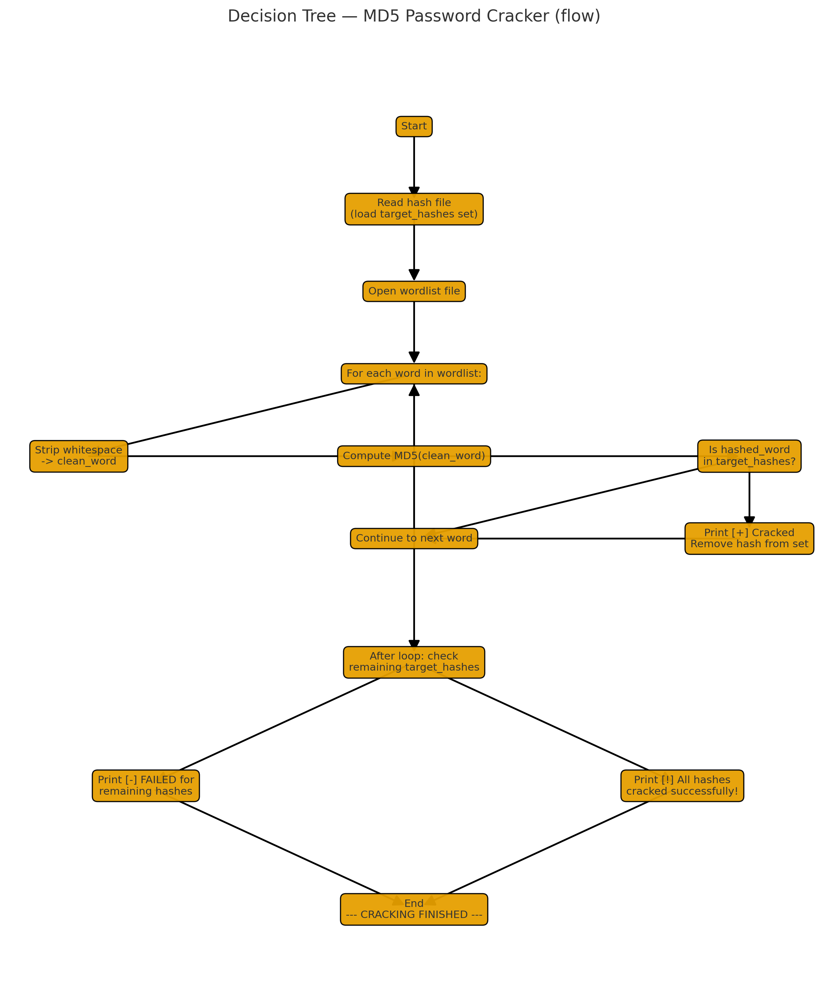

# MD5 Password Cracker

A simple, educational Python script that attempts to crack MD5 password hashes by comparing them against a provided wordlist.

> **Warning:** This script is for learning and defensive/security testing only. Do not use it against systems or data you do not own or have explicit permission to test.

---

## Features
- Reads a list of target MD5 hashes from a file.
- Iterates through a provided wordlist, hashing each candidate with MD5.
- Reports matches (i.e., cracked hashes) and prints any remaining (uncracked) hashes.
- Simple, easy-to-follow procedural structure — great for learning.

---

## Requirements
- Python 3.6+ (script uses standard library only)
- Optionally: a wordlist file (e.g., `wordlist.txt`) and a file with MD5 hashes (one per line)

---

## Usage
1. Save the script (the code you provided) to a file, for example `jane_the_ripper.py`.
2. Run the script:
   ```bash
   python jane_the_ripper.py
3. 
* Enter path to hash file: /path/to/hashes.txt
* Enter path to wordlist file: /path/to/wordlist.txt

## Decision tree
